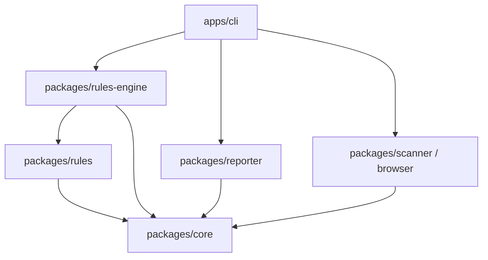

# Implementation Plan - Phase 2: Clean Architecture + Rule System

Transition the Frontend Experience Analyzer from an MVP where rules and reporting are hardcoded inside `apps/cli/src/index.ts` into a clean, scalable multi-package architecture.

## Overview of Phase 2 Architecture



1. **`packages/core`**: Enhance core types (`Finding`, `RuleDefinition`, `StandardReference`, `SourceLocation`, `AnalysisResult`).
2. **`packages/rules`**: Modularize all built-in rules with rich metadata (WCAG references, recommendations, severity, deterministic evaluators).
3. **`packages/rules-engine`**: Implement the rule executor, filtering (`include`/`exclude`), deterministic finding ID generation (hash/slug based on ruleId + page + element), and finding deduplication.
4. **`packages/reporter`**: Dedicated package for HTML & JSON report generation, asset management, summary aggregation, and screenshot overlay positioning.
5. **`apps/cli`**: Refactor into a clean orchestration layer handling argument parsing, logging, and coordinating scanner -> engine -> reporter.
6. **`tests`**: Automated unit tests for rules and rule engine behavior using mock page snapshots.

---

## Proposed Changes

### 1. `packages/core`

#### [MODIFY] [packages/core/src/types/finding.ts](file:///c:/Users/kreng/Desktop/train/frontend-experience-analyzer/packages/core/src/types/finding.ts)
- Add `ruleId` to `Finding`.
- Add `wcag` criterion tags (e.g. `["2.5.8"]`).
- Add optional `sourceLocation` hook for future framework adapter phases (file, line, column, componentName).
- Add `htmlSnippet` to `ElementReference` in [element.ts](file:///c:/Users/kreng/Desktop/train/frontend-experience-analyzer/packages/core/src/types/element.ts).

#### [NEW] [packages/core/src/types/rule.ts](file:///c:/Users/kreng/Desktop/train/frontend-experience-analyzer/packages/core/src/types/rule.ts)
- Define `RuleDefinition` and `RuleContext` interfaces for extensible rule authoring.

---

### 2. `packages/rules`

#### [NEW] [packages/rules/package.json](file:///c:/Users/kreng/Desktop/train/frontend-experience-analyzer/packages/rules/package.json) & [tsconfig.json](file:///c:/Users/kreng/Desktop/train/frontend-experience-analyzer/packages/rules/tsconfig.json)
- Package configuration for `@frontend-experience-analyzer/rules`.

#### [NEW] [packages/rules/src/rules/](file:///c:/Users/kreng/Desktop/train/frontend-experience-analyzer/packages/rules/src/rules/)
Implement discrete rule modules:
- `page-title.ts`: Missing or empty `<title>`
- `image-alt.ts`: Missing `alt` attribute on ``
- `form-label.ts`: Missing label on form controls (`input`, `select`, `textarea`)
- `accessible-name.ts`: Interactive control missing accessible name
- `target-size.ts`: Click/touch target smaller than 24x24px (WCAG 2.5.8)
- `viewport-overflow.ts`: Visible element overflowing viewport boundary
- `page-load-failure.ts`: Browser load / navigation failure
- `index.ts`: Built-in rule registry exporting all standard rules.

---

### 3. `packages/rules-engine`

#### [NEW] [packages/rules-engine/package.json](file:///c:/Users/kreng/Desktop/train/frontend-experience-analyzer/packages/rules-engine/package.json) & [tsconfig.json](file:///c:/Users/kreng/Desktop/train/frontend-experience-analyzer/packages/rules-engine/tsconfig.json)
- Package configuration for `@frontend-experience-analyzer/rules-engine`.

#### [NEW] [packages/rules-engine/src/engine.ts](file:///c:/Users/kreng/Desktop/train/frontend-experience-analyzer/packages/rules-engine/src/engine.ts)
- Rule execution engine:
  - `registerRule(rule: RuleDefinition)`
  - `runRules(snapshot: PageSnapshot, options?: RunOptions): Finding[]`
  - Rule filtering: `--include-rules`, `--exclude-rules`, `--include-categories`
  - Deterministic ID generator (`generateFindingId(ruleId, pageUrl, element)`)
  - Deduplication pipeline to prevent duplicate findings on identical elements.

---

### 4. `packages/reporter`

#### [NEW] [packages/reporter/package.json](file:///c:/Users/kreng/Desktop/train/frontend-experience-analyzer/packages/reporter/package.json) & [tsconfig.json](file:///c:/Users/kreng/Desktop/train/frontend-experience-analyzer/packages/reporter/tsconfig.json)
- Package configuration for `@frontend-experience-analyzer/reporter`.

#### [NEW] [packages/reporter/src/](file:///c:/Users/kreng/Desktop/train/frontend-experience-analyzer/packages/reporter/src/)
- `json.ts`: JSON report serialization.
- `html.ts`: Clean, accessible HTML report generator with screenshot overlay calculations and evidence tables.
- `summary.ts`: Finding counts, severity matrices, and page statistics.
- `index.ts`: Export `generateHtmlReport`, `generateJsonReport`, `writeReports`.

---

### 5. `apps/cli`

#### [MODIFY] [apps/cli/package.json](file:///c:/Users/kreng/Desktop/train/frontend-experience-analyzer/apps/cli/package.json)
- Add workspace dependencies: `@frontend-experience-analyzer/rules`, `@frontend-experience-analyzer/rules-engine`, `@frontend-experience-analyzer/reporter`.

#### [MODIFY] [apps/cli/src/index.ts](file:///c:/Users/kreng/Desktop/train/frontend-experience-analyzer/apps/cli/src/index.ts)
- Refactor CLI into pure orchestration:
  - Parse CLI flags (`--rules`, `--exclude-rules`, `--categories`, etc.).
  - Instantiate `BrowserSession` & scanner.
  - Execute `RulesEngine` over snapshots.
  - Invoke `Reporter` to write output files.

---

### 6. Tests

#### [NEW] [tests/rules.test.ts](file:///c:/Users/kreng/Desktop/train/frontend-experience-analyzer/tests/rules.test.ts)
- Unit tests validating rule evaluation against mock `PageSnapshot` fixtures (missing title, missing alt, small targets, overflows, etc.).
- Unit tests validating engine rule filtering (`include`/`exclude`) and deterministic ID stability.

---

## Verification Plan

### Automated Tests
- Run `node --test` or TypeScript test runner across unit test fixtures:
  ```powershell
  pnpm test
  ```
- Verify clean build and typechecking across all workspace packages:
  ```powershell
  pnpm build
  pnpm typecheck
  ```

### End-to-End Scan Verification
- Run CLI scan against a live/mock page or test target:
  ```powershell
  node apps\cli\dist\index.js scan --help
  ```
- Validate generated `reports/report.json` and `reports/report.html`.
